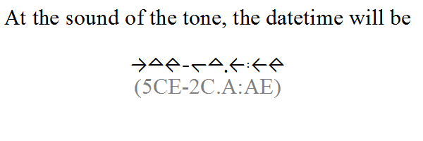

BlackDiamond
============

BlackDiamond is a font for hexadecimal numbers. It contains symbols for
`[0-9a-fA-F.:-]`.  For example, the following image shows BlackDiamond used to
write a date and time in hex-time notation. See
[a flash animation](http://web.archive.org/web/20110315191612/http://www.ruinsofmorning.net/flash/hexclock.php)
for a demonstration of hex time. The date is a generalization of hex time into a
hex date system.

To build a TrueType font file called `BlackDiamond.ttf` using
[FontForge](http://fontforge.sf.net), run the build script under FontForge.

    fontforge -script build.ff

BlackDiamond is made available under the Apache 2.0 License. See the LICENSE
file for details.
